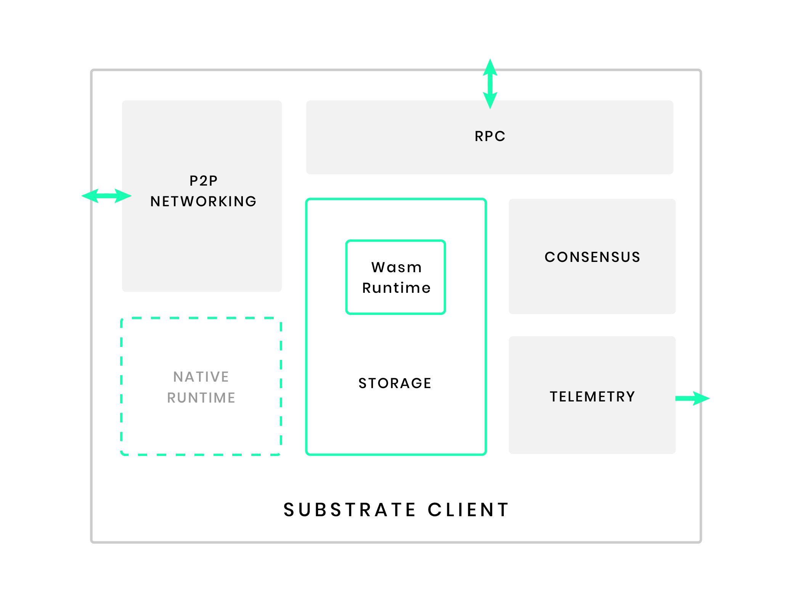
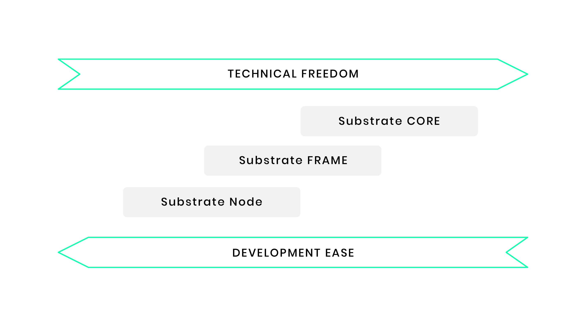

This page is the top level entry point into the Substrate documentation.

> **Some Expertise Needed**
>
> In order to get the most out of Substrate, you should have a good knowledge of blockchain concepts and basic
> cryptography. Terminology like header, block, client, hash, transaction and signature should be familiar. At present
> you will need a working knowledge of Rust to be able to do any significant customization/adaption of Substrate (though
> eventually, we aim for this not to be the case).

Substrate is a blockchain development framework with a completely generic State Transition Function
([STF](knowledgebase/getting-started/glossary#stf-state-transition-function)) and modular components for consensus,
networking, and configuration.

Despite being "completely generic", it comes with both standards and conventions - particularly with the Substrate
runtime module library (a.k.a [FRAME](knowledgebase/runtime/frame.md)) - regarding the underlying data-structures that
power the STF, thereby making rapid blockchain development a reality.

## Architecture

The Substrate client is an application that runs a Substrate-based blockchain node - it consists of several components
that include, but are not limited to, the following:

- **Storage** is used to persist the evolving state of the decentralized system represented by a blockchain. The
  blockchain network allows participants to reach trustless [consensus](knowledgebase/advanced/consensus) about the
  state of storage. Substrate ships with a simple and highly efficient
  [key-value storage mechanism](knowledgebase/advanced/storage).
- **Runtime** logic defines how blocks are processed, including state transition logic. In Substrate, runtime code is
  compiled to [Wasm](knowledgebase/getting-started/glossary#webassembly-wasm) and becomes part of the blockchain's
  storage state - this enables one of the defining features of a Substrate-based blockchain:
  [forkless runtime upgrades](knowledgebase/advanced/executor#forkless-runtime-upgrades). Substrate clients may also
  include a "native runtime" that is compiled for the same platform as the client itself (as opposed to Wasm). The
  component of the client that dispatches calls to the runtime is known as the
  [executor](knowledgebase/advanced/executor) and it selects between the native code and interpreted Wasm. Although the
  native runtime may offer a performance advantage, the executor will select to interpret the Wasm runtime if it
  implements a newer [version](knowledgebase/advanced/executor#runtime-versioning).
- **Peer-to-peer network** capabilities allow the client to communicate with other network participants. Substrate uses
  [the `libp2p` network stack](https://libp2p.io/).
- **Consensus** engines provide logic that allows network participants to agree on the state of the blockchain.
  Substrate makes it possible to supply custom consensus engines and also ships with several consensus mechanisms that
  have been built on top of [Web3 Foundation research](https://w3f-research.readthedocs.io/en/latest/index.html).
- **RPC** (remote procedure call) capabilities allow blockchain users to interact with the network. Substrate provides
  HTTP and WebSocket RPC servers.
- **Telemetry** metrics are exposed by way of an embedded [Prometheus](https://prometheus.io/) server.

## Usage

Substrate is designed to be used in one of three ways:

1. **With the Substrate Node**: You can run the pre-designed
   [Substrate Node](https://github.com/paritytech/substrate/tree/master/bin/node) and
   [configure](https://github.com/paritytech/substrate/blob/master/bin/node/cli/src/chain_spec.rs) it with a genesis
   block that includes the default node
   [runtime](https://github.com/paritytech/substrate/blob/master/bin/node/runtime/src/lib.rs). In this case, you just
   need to configure a JSON file and launch your own blockchain. This affords you the least amount of customization,
   only allowing you to change the genesis parameters of the included runtime modules such as: Balances, Staking, and
   Sudo. For a tutorial on doing this, see
   [Start a Private Network with Substrate](tutorials/start-a-private-network/index.md).

2. **With Substrate FRAME**: You can easily create your own custom runtime using [FRAME](knowledgebase/runtime/frame.md)
   (Framework for Runtime Aggregation of Modularized Entities), which is the method used by the Substrate Node. This
   affords you a very large amount of freedom over your blockchain's logic, and allows you to configure data types,
   select from a library of modules (called "pallets"), and add your own custom pallets. Much can be changed without
   touching the block-authoring logic since it is directed through runtime logic. If this is sufficient, then the
   existing Substrate binary can be used for block authoring and syncing; the
   [Substrate Developer Hub Node Template](https://github.com/substrate-developer-hub/substrate-node-template) is a
   helpful starting point for projects with such needs. For a tutorial on this, see
   [Create Your First Substrate Chain](tutorials/create-your-first-substrate-chain/index.md).

3. **With Substrate Core**: The entire FRAME system can be ignored, and the runtime can be designed and implemented from
   scratch. This could be done in _any language_ that can target [WebAssembly](https://webassembly.org/). If the runtime
   can be made to be compatible with the abstract block authoring logic of the Substrate node, then you can simply
   construct a new genesis block from your Wasm blob and launch your chain with the existing Rust-based Substrate
   client. If not, then you will need to alter the client's block authoring logic, and potentially even alter the header
   and block serialization formats. In terms of development effort, this is by far the most difficult way to use
   Substrate, but also gives you the most freedom to innovate.

## Next Steps

### Learn More

- View our developer documentation for [using the FRAME for module development](knowledgebase/runtime/frame.md).

### Examples

- Follow our
  [tutorial to create your first custom blockchain with Substrate](tutorials/create-your-first-substrate-chain/).

- Follow our [tutorial to start a private network with Substrate](tutorials/start-a-private-network/).

- Follow our [tutorial to add a pallet to your FRAME runtime](tutorials/add-a-pallet/).

### References

- Check out [Rust reference documentation](https://crates.parity.io).
