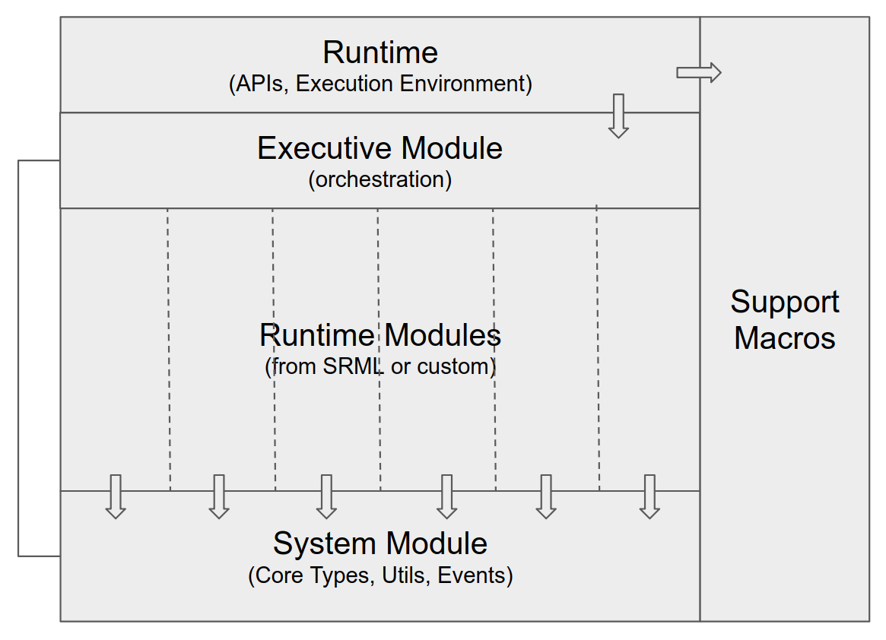

The Substrate Runtime Module Library (SRML) is a collection of runtime modules.

## What are runtime modules?

A Substrate runtime can be composed of several smaller components for separation of concerns. These components are called runtime _modules_. A runtime module packages together a set of functions (dispatchable extrinsic calls, public or private, mutable or immutable), storage items, and possibly events to support a certain set of features for a runtime. We can think of SRML modules as packages that can be used to create other packages or runtimes (similar to npm packages for node.js apps).

## SRML Architecture

The Substrate codebase ships with a set of runtime modules and some framework components to support their execution environment. The following diagram shows the architectural components of the SRML and its support libraries.

There are four primary framework components that support the runtime modules.

### System Module

The [System module](https://crates.parity.io/srml_system/index.html) provides low-level APIs and utilities for other modules. Think of this as the "std" (standard) library for the SRML. In particular, the system module defines all the core types for the Substrate runtime. It also defines extrinsic events (Success/Failure). All other modules (custom or part of SRML) depend on the system module.

### Executive Module

The [Executive module](https://crates.parity.io/srml_executive/index.html) acts as the orchestration layer for the runtime. It dispatches incoming extrinsic calls to the respective modules in the runtime.

### Support Macros

The [support macros](https://crates.parity.io/srml_support/index.html) are a collection of Rust macros that help us implement the most common components of a module. These macros expand at runtime to generate types (Module, Call, Store, Event, etc.), which are used by the runtime to communicate with the modules. Some of the common support macros are `decl_module`, `decl_storage`, `decl_event`, `ensure`, etc.

### Runtime

The Runtime brings together all the framework components and modules. It expands the support macros to get the types and trait implementations for each module. It also calls the Executive module to dispatch calls to the individual modules.

## SRML Modules

The SRML ships with a set of pre-defined modules that can be reused across runtimes as stand-alone packages of features. For example, the `Balances` module in the SRML can be used to track accounts and balances, the `Assets` module can be used to create and manage _fungible_ assets, and so on.

You can build your own custom module by deriving from the system module (described above) and also optionally deriving from one or more of the SRML modules to use their functionality.

The following are the modules that ship with the SRML.

* [Assets]()
* [Aura](https://crates.parity.io/srml_aura/index.html)
* [Balances](https://crates.parity.io/srml_balances/index.html)
* [Consensus](https://crates.parity.io/srml_consensus/index.html)
* [Contract](https://crates.parity.io/srml_contract/index.html)
* [Council](https://crates.parity.io/srml_council/index.html)
* [Democracy](https://crates.parity.io/srml_democracy/index.html)
* [Finality Tracker](https://crates.parity.io/srml_finality_tracker/index.html)
* [Grandpa](https://crates.parity.io/srml_grandpa/index.html)
* [Indices](https://crates.parity.io/srml_indices/index.html)
* [Session](https://crates.parity.io/srml_session/index.html)
* [Staking](https://crates.parity.io/srml_staking/index.html)
* [Sudo](https://crates.parity.io/srml_sudo/index.html)
* [Timestamp](https://crates.parity.io/srml_timestamp/index.html)
* [Treasury](https://crates.parity.io/srml_treasury/index.html)
