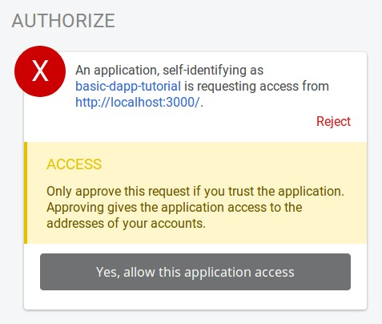

In this tutorial, we do no show how to create accounts using this `api` although it's possible. The reason is simple, we do not want to encourage developpers to manage accounts in the browser. DNS attacks, pishing and other common attacks put users at risk. If the use case of the DApp allows it, we suggest to use injected accounts instead. Users will create and manage their accounts externally to the DApp, we will simply use these accounts if the user accepts it. In this Part, we will show how you can show external accounts balance and send a transaction.

# 4.1 Get Polkadot-js extension

Get into our user's shoes and install the [Polkadot-js enxtension](https://github.com/polkadot-js/extension) from the [Chrome](https://chrome.google.com/webstore/detail/polkadot%7Bjs%7D-extension/mopnmbcafieddcagagdcbnhejhlodfdd?hl=en) or [Firefox](https://addons.mozilla.org/en-US/firefox/addon/polkadot-js-extension/) store. 
Create and account using the extension and give it a name.

We will now adapt our application to inject any account created externally in our current interface.

This is how the extension looks like with 2 accounts creatively named Bob and Alice:


# 4.2 Display external account's balances

Externally generated accounts loaded thank to [`@polkadot/extension-dapp`](https://github.com/polkadot-js/extension/tree/master/packages/extension-dapp).
```bash
yarn add @polkadot/extension-dapp@beta
```

This package give us access to `web3Enable` to declare our DApp and request the right to read the accounts from our users. `isWeb3Injected` lets us know if our users have an extension supporting the `@polkadot/extension-dapp` protocol, and finally the `web3Accounts` function that should be called if the user has a compatible extension, and has granted us access to their accounts.

To keep things simple, we will not display anything else than a loader to our users while the authorization is requested. This is a blocking experience that should not be reproduced in a real DApp. Rather show something to your users, and patiently wait for them to accept the extension request.

We will introduce a new state variable `accountLoaded` to show this loader in case our user have an extension but havn't granted us access to their accounts.

```js
// Toward the top of Apps.js
// new state variables to monitor the account loading status
const [accountLoaded, setaccountLoaded] = useState(false);

// in our render function, show a loader to users with a compatible extension while 
// waiting for their authorization
if (!accountLoaded) {
return loader('Loading accounts (please review any extension\'s authorization)');
}
```

We will declare our DApp and request access to the external accounts in a `useEffect` React hook that we are now familiar with. We used to call `loadAccounts()` to initialize the keyring. This function also accepts injected accouts as arguments, so all we'll have to do is `loadAccounts(injectedAccounts)`. Quite handy isn't it?
Instead of calling `loadAccounts` in its own `useEffect` React hook though we will call it once we have collected the external accounts, or if the user doesn't have an extension, or hasn't granted us access to it. 


```js
// beginning of Apps.js
import { isWeb3Injected, web3Accounts, web3Enable } from '@polkadot/extension-dapp';


// new hook to get injected accounts
useEffect(() => {
    web3Enable('basic-dapp-tutorial')
    .then((extensions) => {
    // web3Account promise only resolves if there are accounts to inject
    web3Accounts()
        .then((accounts) => {
        // add the source to the name to avoid confusion
        return accounts.map(({ address, meta }) => ({
            address,
            meta: {
            ...meta,
            name: `${meta.name} (${meta.source})`
            }
        }));
        })
        // load our keyring with the newly injected accounts
        .then((injectedAccounts) => {
            loadAccounts(injectedAccounts);
        })
        .catch(console.error);
    })
    .catch(console.error);

// if there is no injection, or the user hasn't accepted it,
// load any local account
!isWeb3Injected && loadAccounts();
}, []);

const loadAccounts = (injectedAccounts) => {
    keyring.loadAll({
        isDevelopment: true
    }, injectedAccounts);
    setaccountLoaded(true);
};
```

We have added yet a little overhead to the above code, this part is not mandatory:

```js
.then((accounts) => {
    // add the source to the name to avoid confusion
    return accounts.map(({ address, meta }) => ({
        address,
        meta: {
        ...meta,
        name: `${meta.name} (${meta.source})`
        }
    }));
})
```

What it does is to extract the injected accounts's info, to modify the displayed name and add the `meta.source` to it. This way, our external Alice and Bob will be clearly identified as comming from the extension.

Because everything is nicely integrated in our Keyring, we don't have to touch our `Balances` component, it will manage external accounts just like the internal ones.

You can get the working version of this code by visiting `part-4-2` directory:
```bash
cd part-4-2;
yarn;
yarn start;
```
If you run this example, you will get prompted with an authorization request from `basic-dapp-tutorial`.


And you should see the balances of your external accounts below the testing accounts is you accepted the request.


Also if you open the console, you will see something similar to:
```bash
web3Enable: Enabled 1 extension: polkadot-js/0.5.1 index.js:135
web3Accounts: Found 2 addresses: 5ECyNdxrwuzmsmfPJU64zMyJo8dV86hXfjjxK3PmZx1YCurj, 5ExttMT4rtnYJ7TLn19d8C8sVdTH8exj7pxWPC5xepz7J9KF
```

# 4.3 Send fund from external accounts

Although the `Balances` component doesn't have to be modified to cater for the external accounts, our `Transfer` component will need some change. The reason is simple, our DApp doesn't have the cryptographic key pairs for those external accounts. Those are securely handled by an extension, and we will not have access to it. To make transfer, we will have to send the transaction to the extension, the user will then be prompted to sign it.

```js
import { web3FromSource } from '@polkadot/extension-dapp';

const { addressTo, addressFrom, amount } = formState;
const fromPair = keyring.getPair(addressFrom);
// extract isInjected from the keyring metadata
const { address, meta: { source, isInjected } } = fromPair;
let fromParam;

// set the signer
if (isInjected) {
    const injected = await web3FromSource(source);
    fromParam = address;
    api.setSigner(injected.signer);
} else {
    fromParam = fromPair;
}

setStatus('Sending...');

api.tx.balances
.transfer(addressTo, amount)
.signAndSend(fromParam, ({ status }) => {
```

# 4.4 Good to know

If you play around with this DApp, and send for example 1 "unit" from Alice to your newly created extension account, you will realize a couple things. First of all, Alice account gets decreased, by more than 1 unit. You probably got it, you need to pay fees for the transfer.

Now more currious, the transaction is successfull, yet Bob's balance remains unchanged. This is not a bug, it's a feature, explication:
The Substrate node we are querying has a `Balance` module. This module is responsible for keeping track of aaaaall the accounts on the blockchain. Our blockchain is a dev one, that's being reset every hour, but imagine a production blockchain that anyone can access. Now imagine that this blockchain becomes popular and maaaany accounts are created, some of them containing a fraction of a cent in value. The blockchain ends up using a lot of storage for useless accounts. To combat this, the `Balances` module that our node contains has a so called *Existential Deposit* a.k.a ED. If an account has less funds than this ED, the account will be removed entirely from the state. on the `--dev` node, the ED is `100'000'000`. So make sure to send around great amount of units if you want to see things change.

Also if you transfer funds to a newly created account, there will be a so called creation fee applied. To have an overview of all the fees that may apply, there's a derive query for that [`api.derive.balances.fees`](https://github.com/polkadot-js/api/blob/master/packages/api-derive/src/balances/fees.ts)!

# 4.3 Getting further - Extract the send button into its own component